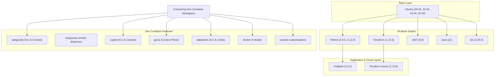

# Specification: Layered Container Vault & Dev Container Features Architecture

## 1. Executive Summary

* **Owner / Sponsor:** Antigravity Engineering Team
* **Target Environment:** GitHub Actions, GHCR (`ghcr.io/armckinney`), VS Code Dev Containers
* **Last Audited:** 2026-10-05

### Overview
This repository provides a standardized infrastructure layer consisting of two primary components:
1. **Layered Container Image Vault**: A tree of reusable, standardized multi-arch Docker images hosted on GitHub Container Registry (`ghcr.io/armckinney/<image>:<tag>`), where higher-level images inherit directly from base distributions.
2. **Dev Container Features Ecosystem**: Modular Dev Container Features adhering to the Development Containers specification, enabling reproducible local and remote AI agent environments, CLI tools, and runtime configurations.

---

## 2. System Architecture & Topology

### High-Level Block Diagram

### Subsystems & Interfaces

#### 1. Layered Container Hierarchy
* **Location:** `containers/<image>/<tag>/`
* **Structure:** Each image version contains:
  * `Dockerfile`: Production release image optimized for size and security.
  * `Dockerfile.dev`: Development image containing development tooling and debugging utilities.
* **Lineage & Dependency Trees:**
  * `ubuntu`: Base root layer providing OS security updates, standard utility packages (`curl`, `git`, `jq`), and locale settings.
  * `python`: Extends `ubuntu` by compiling or installing Python runtimes, `pip`, and core build tools.
  * `pyspark`: Extends `python` by layering OpenJDK and Apache Spark distributions.
  * `terraform`: Extends `ubuntu` by bundling HashiCorp Terraform binaries.
  * `terraform-azure`: Extends `terraform` by incorporating the Azure CLI toolchain.
  * `dotnet`, `java`, `go`: Independent runtimes layered over `ubuntu`.

#### 2. Dev Container Features Platform
* **Location:** `features/src/<feature>/`
* **Structure:** Each feature contains:
  * `devcontainer-feature.json`: Metadata, configurable options schema, required host mounts, and VS Code extensions.
  * `install.sh`: POSIX/Bash script executed at dev container build time.
  * Optional lifecycle scripts (`setup-symlinks.sh`, entrypoint wrappers).
* **Test Suites:** `features/test/<feature>/` provides automated tests (`test.sh` and `scenarios.json`) run against clean base images via the Dev Container CLI.

#### 3. Distribution & Registry Pipelines
* **Image Registry:** Multi-arch container images (`linux/amd64`, `linux/arm64`) published to `ghcr.io/armckinney/<image>:<tag>`.
* **Feature Distribution:** Feature packages compressed as tarballs (`devcontainer-feature-<name>.tgz`) and attached to GitHub Releases.

---

## 3. Core Design Decisions & Trade-offs

* **Layered Inheritance vs. Monolithic Images:**
  * *Decision:* Base images are isolated and reused across higher-level stacks (`ubuntu` → `python` → `pyspark`).
  * *Trade-off:* Image updates in the base layer require rebuilding downstream images, but image cache deduplication across teams and fast CI layers significantly reduces bandwidth and build times.
* **Separation of Base Images and Dev Container Features:**
  * *Decision:* Keep OS/language runtime images strictly focused on build/runtime dependencies, while developer-specific productivity tools (Copilot, Antigravity, Gyrus, Databricks) are packaged as Dev Container Features.
  * *Trade-off:* Requires devcontainer runtime parsing, but completely prevents tool bloat in base images and allows developers to compose custom toolsets per workspace.
* **Dual Dockerfiles (`Dockerfile` vs `Dockerfile.dev`):**
  * *Decision:* Maintain production and development variants per version folder.
  * *Trade-off:* Slight maintenance overhead, but provides dedicated space for dev tooling while keeping production images pristine.

---

## 4. Cross-Cutting Concerns & Technical Boundaries

* **Build Context Rule:** All Docker builds must use the repository root (`.`) as the build context to allow sharing common setup scripts.
* **Security & Non-Root Execution:** Container features must operate cleanly when `remoteUser` is non-root (e.g. `vscode`), setting appropriate file ownership on mounted credentials and installed binaries.
* **Context Isolation:** AI context and memory subsystems (e.g., Gyrus, Antigravity) are integrated through standardized filesystem interfaces without hardcoding external host dependencies.
